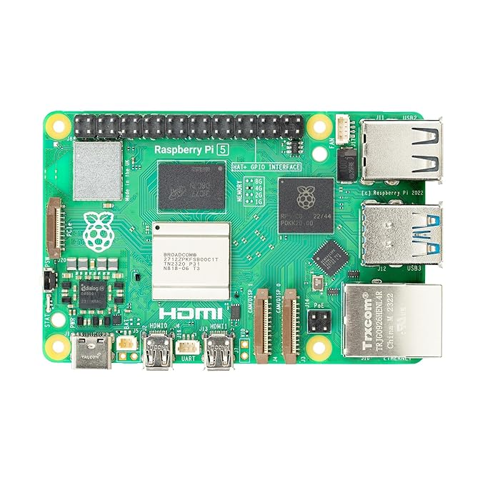

# Raspberry PI 5 Interfacing



**Raspberry Pi** is a *Single Board Computer* (SBC) developed by Raspberry Pi Foundation.  It has Broadcom SOC at its heart. IT primarily runs on Linux. 

Its Linux Distribution is based on the **Debian** customised for *Rasoberry-Pi* and hence called as **Raspbian**.   


## Creating Python Virtual Environment
The native python envronment of Raspbian OS is protected and we cant install new packages/ modules 
using pip in  the native environment. 

We need to create virtual environment of python so as to install python modules using pip

To create Virual Environment of python in Raspberry Pi

1. 	Open the terminal by Pressing `Ctrl+Alt+T`
2.	Type the following command to create new virtual environment

	```
		python3 -m venv --system-site-packages .venv
	```
3.	set the **Thonny** to use newly created virtual environment
	- Open Thonny, and click on *Switch to regular mode* on right top corner,
		then restart the thonny
	- Go to *Tools->Options-> Interpreter* and click on three dots (...) button 
			Brows to *.venv/bin/python3.xx* [XX will be replaced by python versionistalled on your system]
			file and click on *OK*
	- Again Click on *OK* to close the tools window
	- Restart the *Thonny* again

## Python Module Installation

Before installing the python packages make sure that you hace seup the *python 
virtual environment* on the system.

Open the Terminal by pressing `CTRL+ALT+T`

The terminal will get open on your screen but it will refereing to the default *local python
environment*, which is *protected* in nature and will not allow you to install any third party package
by using *pip*.

So we need to activate the virtual environment we have created earlier. To do so, type the 
following command in the terminal

```
source .venv/bin/activate
```

After you type the command, hit `Enter` button and you will see `(.venv)` before the command prompt of the terminal.
This will indicate that, virtual environment is activated and your terminal is now refering to the virtual environment.

In simple words, whatever commands you will enter in the terminal are executed in the virtual environment and
will not affect the local python environment.

Now you are all set to install the third-party packages. Use the following commands to install respective module in virtual environment.

### ADC [ADS1115]

```
pip install adafruit-circuitpython-ads1x15
```

### Fingerprint Module [R307]

```
pip install pyfingerprint
```

### Keyboard (Required For 7 Segment Stopwatch)

```
pip install pynput
```

### MQTT Client (Required for Home AUtomation)

```
pip install paho-mqtt
```


